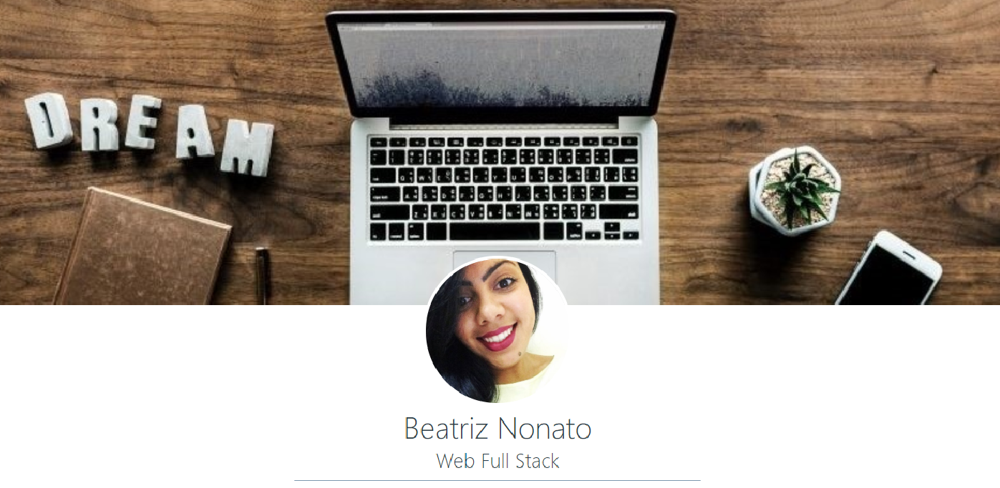
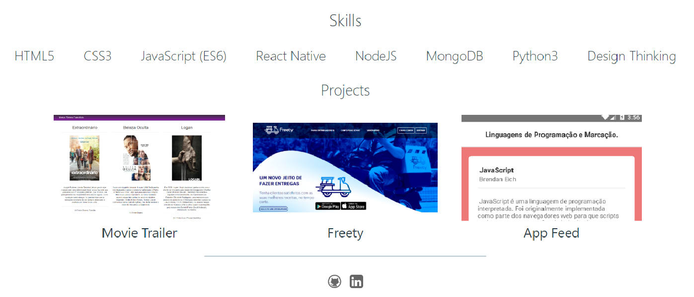

# Portfolio

### Website Content

1. Profile
2. Skills
3. Projects
3. Contact

## How to Run
- Clone this repository
- Open the project folder
- Double-click on the index.html file, as soon afterwards you will be redirected to the browser with the application running.

### License
MIT © Beatriz Nonato :woman_technologist:
